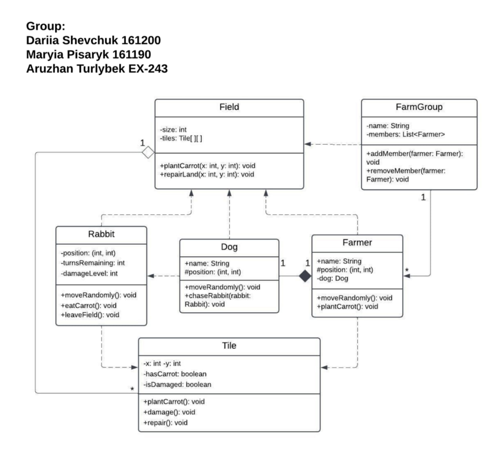

# Farm Simulation System

## Team
- Dariia Shevchuk (161200)  
- Mariya Pisaryk (161190)  
- Aruzhan Turlybek (EX-243)

---

## Overview
The **Farm Simulation System** is an object-oriented Java project that models a simple interactive farm environment using **concurrent programming**.  
Each entity (farmer, dog, rabbit) runs as an independent thread, allowing simultaneous actions and interactions within the farm field.  

This approach demonstrates both **OOP design principles** and **multithreading concepts**, providing a realistic simulation of parallel behavior on a farm — where multiple actors operate at the same time.

---

## Main Features

### Concurrent Simulation
- Each entity (Farmer, Dog, Rabbit) executes in its own thread.  
- The system uses **Java concurrency mechanisms** (`Thread`, `Runnable`) to run multiple entities simultaneously.  
- The simulation demonstrates **thread-safe interaction**, **shared resource management**, and **independent execution** of objects.  
- Farmers, dogs, and rabbits move, act, and respond concurrently within the field grid.

### Farm Environment
- The **Field** class represents the main simulation space, divided into a 2D grid of **Tile** objects.  
- Each **Tile** can hold one entity and ensures safe updates when accessed by multiple threads.  
- The **Field** synchronizes interactions between entities to prevent conflicts.

### Entities and Behavior
- The **Entity** abstract class defines common properties such as position and movement.  
- Subclasses extend this class to represent specific roles:
  - **Farmer:** performs agricultural work or monitors animals.  
  - **Dog:** protects the farm and can chase rabbits.  
  - **Rabbit:** moves randomly and simulates a dynamic, unpredictable animal.  
- Each entity runs concurrently and interacts with others through synchronized methods and shared data structures.

### Simulation Control
- The **Main** class initializes the field, spawns entities, and starts all threads.  
- The simulation runs for a defined duration or number of steps, during which entities act simultaneously.  
- The output shows concurrent movements and interactions on the field.

---

## UML Diagram
The UML diagram below illustrates the class hierarchy and relationships within the system:

---

## Project Structure

| File | Description |
|------|-------------|
| `Entity.java` | Abstract base class defining shared attributes (position, movement, and threading). |
| `Farmer.java` | Implements a thread that simulates a farmer’s concurrent actions. |
| `Dog.java` | Threaded class representing a guard dog that can interact with rabbits. |
| `Rabbit.java` | Threaded entity that moves randomly across the field. |
| `Field.java` | Manages the 2D simulation grid and ensures thread-safe operations. |
| `Tile.java` | Represents a single cell in the field and stores an entity reference. |
| `FarmGroup.java` | Controls all entities, starting and managing their concurrent execution. |
| `Main.java` | Entry point for initializing and running the multithreaded simulation. |

---

## Key Concepts Demonstrated
- **Object-Oriented Design:** Encapsulation, inheritance, polymorphism, and abstraction.  
- **Concurrency:** Use of threads to run multiple entities simultaneously.  
- **Synchronization:** Ensuring thread safety and avoiding race conditions.  
- **Composition:** Field and tiles form the environment where entities coexist.  
- **Parallel Interaction:** Independent entity behavior and shared field updates occurring at the same time.  

